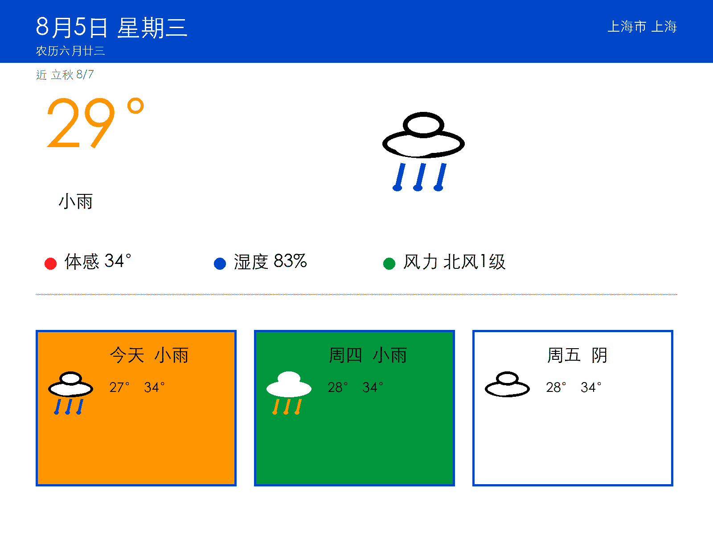
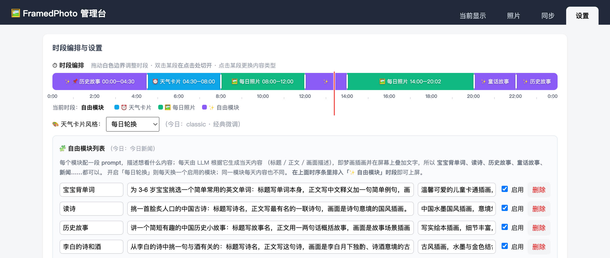
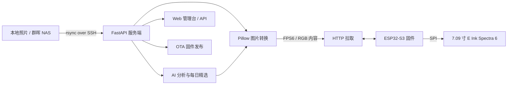

<div align="center">
  <h1>FramedPhoto</h1>
  <p><strong>把照片、天气和一点点 AI，放进一块每天都会更新的彩色电子纸。</strong></p>
  <p>
    <a href="https://github.com/Naoki326/FramedPhoto/stargazers"></a>
    <a href="https://github.com/Naoki326/FramedPhoto/blob/main/LICENSE"></a>
    
    
    
  </p>
</div>

<p align="center">
  
</p>

<p align="center"><sub>界面渲染预览 · 1200 × 1600 · E Ink Spectra 6 六色</sub></p>

---

## 这不只是一个数字相框

普通数字相框只会循环播放照片。**FramedPhoto 把一块低功耗彩色电子纸，变成家里的个人信息窗口：**

- 今天显示天气和日历，晚上切换成一张照片；
- AI 从照片库里找出“历史上的今天”，并配上一句回忆文案；
- 你给自由模块写一段 prompt，它就能每天生成一张不同的图文卡片；
- 设备主动从服务端拉取内容，显示完成后深度休眠，安静、省电地待在墙上。

这是一个从 **ESP32 固件、FastAPI 服务端、图片渲染，到 NAS 与 AI 内容生成** 的完整端到端项目。

## 一眼看懂

| 能力 | FramedPhoto 做什么 |
| --- | --- |
| **照片回忆** | 上传照片、管理内容、AI 评分，自动挑选“历史上的今天” |
| **每日窗口** | 天气、未来几日预报、日历与自定义图文模块按时段轮换 |
| **六色渲染** | 1200 × 1600 图片适配、E Ink Spectra 6 色板量化、抖动与真机校准 |
| **长续航设备** | ESP32-S3 WiFi 拉取内容，显示后深度休眠，按钮唤醒刷新 |
| **远程维护** | 双 OTA 分区、SHA-256 校验、失败回滚 |
| **私人照片库** | 群晖 NAS 通过 `rsync over SSH` 增量同步，掉线时不影响本地使用 |

## 内容会这样流动

默认可以把一天分成三个时段：

```text
00:00 – 10:00   天气 + 日历
10:00 – 21:00   每日照片 / 历史上的今天
21:00 – 24:00   自由模块：LLM 文案 + 插画 + 屏幕叠字
```

自由模块不是写死的新闻页面，而是可配置的内容生成器。例如：宝宝背单词、读诗、历史故事、李白的诗和酒、睡前童话……每天生成一次，生成结果直接适配电子纸的六色显示。

## 不止天气：三种内容模式

FramedPhoto 的核心不是“显示天气”，而是让同一块屏幕在一天里拥有不同的内容。天气只是其中一个时段，另外两个时段分别负责**回忆**和**创造**。

### 1. 每日照片：把历史上的今天挂在墙上

服务端会从照片库中匹配今天的月-日，结合 AI 回忆度评分挑选一张照片，自动生成一句文案并渲染到画面上。没有同日照片时，会降级到全局高分且近期未展示的照片；也可以在管理台手动指定今日精选。

<p align="center">
  
</p>

<p align="center"><sub>每日精选演示：真实照片经 Spectra 6 六色量化，底部叠加 AI 回忆文案（自动生成）</sub></p>

### 2. 自由模块：每天生成一张新的图文卡片

自由模块由一段主题 prompt 驱动：LLM 生成当天的标题、正文和画面描述，图像模型生成插画，服务端再把文字叠加到画面并转换成电子纸可显示的六色卡片。

<p align="center">
  
</p>

<p align="center"><sub>真实生成示例：历史故事《智斗盗马贼》 · LLM 文案 × AI 插画 × 文字叠加 × 六色渲染</sub></p>

内置模块可以直接使用，也可以在管理台添加自己的主题：

- 宝宝背单词
- 读诗 / 李白的诗和酒
- 历史故事
- 童话故事
- 今日新闻（可选）

LLM 失败时降级为模块标题或纯文字卡片；文生图失败时仍可保留文字内容，不会让整个内容编排中断。

### 3. 可定制时间块：你决定什么时候显示什么

默认是“天气 → 每日照片 → 自由模块”的三段式，但并不是写死的。管理台提供 24 小时时间轴，可以：

- 拖动白色边界调整开始时间；
- 双击任意位置切开一个时间块；
- 点击时间块切换为“天气 / 每日照片 / 自由模块”；
- 为自由模块时段固定指定某个主题，或启用每日轮换；
- 支持跨午夜时段，同一模块跨 0 点继续复用同一张卡片。

<p align="center">
  
</p>

<p align="center"><sub>真实服务端设置页：上方是 24 小时时间轴，下方是可自由编辑的模块名称、prompt、插画风格与启用状态</sub></p>

例如可以在管理台编排出这样的日程：

```json
[
  {"start": "00:00", "type": "weather"},
  {"start": "08:00", "type": "photo"},
  {"start": "18:00", "type": "free", "module": "读诗"},
  {"start": "20:00", "type": "free", "module": "宝宝背单词"},
  {"start": "22:00", "type": "photo"}
]
```

每个时间块最短 30 分钟，最后一段自动延续到 24:00。配置保存后即时生效，设备下一次轮询时就会按照新的内容计划工作。

> 设置页截图来自本地服务端管理台，不代表真实硬件实拍。个人照片不会自动提交到公开仓库；如需展示真实照片，请手动确认后加入（本 README 演示照片为仓库所有者主动选择公开）。

## 系统架构



### 一次内容更新的完整链路

1. 用户通过 Web 管理台或 API 上传/挑选照片。
2. 服务端按屏幕比例适配到 **1200 × 1600**，量化到 Spectra 6 六色，并进行抖动与格式封装。
3. AI 照片分析为内容生成回忆度、美观度、类型与文案；没有 VLM 时自动降级到启发式评分。
4. ESP32 定期请求内容清单，下载当前应显示的内容。
5. 固件解码 FPS6 数据，通过 SPI 刷新电子纸，然后进入深度休眠。
6. 下次唤醒时只有内容发生变化才刷新，避免无意义的屏幕刷新与耗电。

## 硬件

| 部件 | 型号 | 说明 |
| --- | --- | --- |
| 彩色电子纸 | GDEB0709E01 | 7.09 寸、E Ink Spectra 6、1200 × 1600、SPI |
| 主控 | ESP32-S3 开发板 | 16 MB Flash，双 OTA 分区 |
| 电源 | 3.3 V | 电子纸刷新瞬态电流较大，供电需要留足余量 |

硬件规格、引脚映射和官方资料归档见 [`docs/hardware/gdeb0709e01.md`](docs/hardware/gdeb0709e01.md)。

## 快速开始

### 环境要求

- Python 3.12+
- ESP-IDF 6.0.x（仅编译固件时需要）
- 一块 ESP32-S3 开发板与 GDEB0709E01 模组
- 可选：VLM、天气服务、图像生成服务、群晖 NAS

### 1. 启动服务端

```bash
cd services
python3 -m venv .venv
source .venv/bin/activate
pip install -r requirements.txt

cp .env.example .env
# 按需编辑 .env；没有 AI key 也可以先运行，照片分析会降级为启发式评分

uvicorn app.main:app --host 0.0.0.0 --port 8010 --reload
```

启动后可以访问：

- Web 管理台：<http://127.0.0.1:8010>
- API 文档：<http://127.0.0.1:8010/docs>

最小配置只需要启动服务端即可。AI、天气、NAS 和自由模块都可以在后续按需开启，配置项和示例见 [`services/.env.example`](services/.env.example)。

### 2. 编译并烧录固件

```bash
cd firmware
source "$IDF_PATH/export.sh"

idf.py set-target esp32s3
idf.py menuconfig   # 配置 WiFi、服务端地址、休眠周期等
idf.py build
idf.py flash monitor
```

设备端默认通过 mDNS 访问服务端。macOS 上可用下面的命令查看本机名称：

```bash
scutil --get LocalHostName
```

如果换了电脑或修改了服务端地址，在 `idf.py menuconfig` 的 `FramedPhoto Application → Service base URL` 中更新后重新烧录即可。

### 3. macOS 开机自启（可选）

```bash
./scripts/install_service.sh install
```

生产部署、日志、launchd 和内网访问说明见 [`docs/development.md`](docs/development.md)。

## 项目结构

```text
FramedPhoto/
├── firmware/                  # ESP-IDF 固件：WiFi、HTTP、调度、显示与 OTA
│   ├── main/                  # 应用层
│   └── components/gdey_epd/   # GDEB0709E01 电子纸驱动
├── services/                  # FastAPI 服务端与单元测试
│   └── app/                   # 图片转换、设备管理、内容、OTA、Web UI
├── docs/                      # 架构、硬件、API、AI、NAS、校准与路线图
│   └── design-preview/        # 屏幕 UI 渲染预览
├── tools/                     # 图片分析、调色板比较、校准与模拟工具
└── scripts/                   # 烧录、NAS 同步、服务部署脚本
```

## 进度

### 已完成

- [x] ESP32-S3 + GDEB0709E01 驱动移植与双 IC 命令序列
- [x] WiFi 联网、内容清单、FPS6 下载与流式渲染
- [x] FastAPI 服务端、SQLite、设备管理、Web 管理台与 OTA
- [x] AI 照片评分、历史上的今天、回忆文案与启发式降级
- [x] 可配置自由模块：LLM 内容 + 插画 + 电子纸文字叠加
- [x] Spectra 6 调色板 v2、OKLab 感知距离量化与真机校准工具链
- [x] 群晖 NAS `rsync over SSH` 增量同步与掉线容错
- [x] 双 OTA 分区、SHA-256 校验与失败回滚

### 进行中

- [ ] NAS 首轮同步与全量 AI 分析（`tools/analyze_photos.py`）
- [ ] 完整真机验证：棋盘格 → WiFi → 服务端图片 → 每日精选 → 深度休眠

## 文档导航

| 文档 | 内容 |
| --- | --- |
| [`docs/architecture.md`](docs/architecture.md) | 系统架构、数据流与模块边界 |
| [`docs/hardware/gdeb0709e01.md`](docs/hardware/gdeb0709e01.md) | 屏幕规格、引脚映射与硬件资料 |
| [`docs/api.md`](docs/api.md) | 服务端 API 与设备通信接口 |
| [`docs/ai-features.md`](docs/ai-features.md) | AI 分析、每日精选与深度休眠 |
| [`docs/nas.md`](docs/nas.md) | 群晖 NAS 同步与照片库配置 |
| [`docs/calibration.md`](docs/calibration.md) | 调色板、校准图与真机采样流程 |
| [`docs/development.md`](docs/development.md) | 本地开发、macOS 部署与服务管理 |
| [`docs/protocol/fps6-format.md`](docs/protocol/fps6-format.md) | FPS6 文件格式说明 |
| [`docs/roadmap.md`](docs/roadmap.md) | 后续路线图 |

## 开发工具

```bash
# 图片转换与 Spectra 6 预览
python tools/convert_image.py --help

# 扫描照片库并进行 AI/启发式分析
python tools/analyze_photos.py /path/to/photos -j 4

# 生成校准图、比较调色板
python tools/generate_calibration_chart.py --help
python tools/compare_palettes.py --help
```

服务端测试：

```bash
cd services
source .venv/bin/activate
pytest
```

## 隐私说明

这是一个公开仓库，但以下内容只保留在本地，不会进入 Git：

- 个人照片与 NAS 同步目录：`services/photos/`、`services/daily/`
- 上传文件、运行时数据库、日志和缓存
- API key、NAS 密码等环境变量：`services/.env`

开始使用前请检查 `.gitignore`，不要把个人照片、设备运行数据或密钥提交到公开仓库。

## License

[MIT](LICENSE)。固件中引用的第三方组件版权归各自作者所有。

如果你也在做低功耗电子纸、家庭信息屏或 AI 相框，欢迎提交 Issue / PR，一起把它做成真正每天都值得看的东西。
